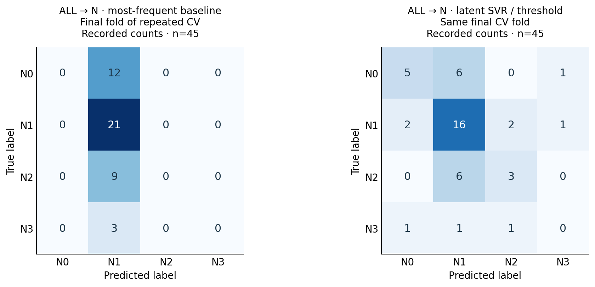
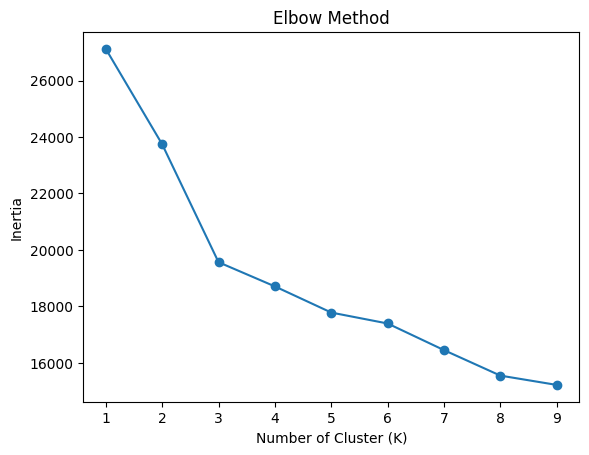

# MedTech

**Exploratory research into clinical feature representations, ordered targets and predictive associations.**

MedTech documents a series of experiments asking whether a clinical masterchart contains useful structure in questionnaire scores, V/P/K-coded attributes and tumour-site features. The work progresses from cleaning, PCA and clustering to shared neural networks, separate T/N prediction, classical and ordinal models, repeated cross-validation and PCA comparisons.

The saved research cohort contains **226 records**. This repository brings together **five notebooks**, a structured results workbook, complete aggregate results and **112 saved confusion matrices**. It is an exploratory analysis project, without a formal paper or an externally validated clinical model.

**Explore:** [experiment guide](docs/experiments.md) · [results and diagnostics](docs/results.md) · [results workbook](results/medtech-results.xlsx) · [Phase 2 handoff](docs/phase-2.md) · [data setup](data/README.md)

## Research questions

1. **Feature representation:** do scored questionnaire features, V/P/K-coded features or their combination carry more useful associations with the outcomes?
2. **Target structure:** does treating T and N separately, or using their ordering, reveal information lost in joint TNM classification?
3. **Model and representation choice:** how do shared neural networks, classical models, ordinal formulations, latent regression and PCA behave on the same small, imbalanced cohort?

These questions motivate follow-up work on feature meaning and relationships. Predictive associations alone do not establish semantic validity, causal effects or clinical usefulness. The original codebook, scoring definitions and an independent cohort are needed for stronger conclusions.

## The experiment series

| Notebook | Work demonstrated |
|---|---|
| [SF 36 exploration](MedTech.ipynb) | Masterchart assessment, feature engineering, PCA, K-means and linear/forest/XGBoost regression. Current supervised preprocessing is learned on training data. |
| [01 · Joint TNM and pain](notebooks/01_joint_tnm_pain.ipynb) | Shared representation, classification/regression heads, dropout, validation-based early stopping and successive feature-set runs. |
| [02 · Joint-TNM architectures](notebooks/02_joint_tnm_architectures.ipynb) | Big/small MLP comparisons, OneCycleLR, confusion matrices, confidence, entropy and pain variance diagnostics. |
| [03 · Separate T/N multitask](notebooks/03_tn_multitask.ipynb) | T, N and pain heads; small/big/ultra architecture sweep; training-only rare-class replication; nine saved comparisons. |
| [04 · Classical, ordinal and PCA](notebooks/04_classical_ordinal_pca.ipynb) | Standard/ordinal classification, five pain regressors, dummy baselines, repeated stratified CV, round/threshold latent decoding and fold-local PCA. |

These are successive research iterations with distinct targets and evaluation protocols. The [experiment guide](docs/experiments.md) documents their methods, corrections and differences in depth.

## Data and feature settings

The older export contained 207 columns, including demographic measurements, tumour site/staging, pain, a spreadsheet outcome labeled `SF 36`, questionnaire items and Prakriti-related attributes. The four later notebooks use a final-masterchart schema with scored questionnaire and V/P/K-coded question columns.

| Setting | Selected feature families | Saved input shape |
|---|---|---|
| **VALUE** | `Value_Q*` and one-hot tumour-site indicators | 226 × 54 |
| **VPK** | `V_Q*`, `P_Q*`, `K_Q*` and one-hot tumour-site indicators | 226 × 220 |
| **ALL** | Both families and one-hot tumour-site indicators | 226 × 256 |

Site features occur in every setting. These counts describe the recorded cohort, not fixed requirements for a new dataset.

Joint-TNM experiments use 21 normalized T/N/M combinations. Later experiments predict T1–T4 and N0–N3 separately, alongside continuous pain regression. They do not predict 21 overall cancer stages. Pain was min-max scaled in these four iterations; its errors below use **normalized pain units**.

The private clinical CSV is not distributed. Repository licensing does not grant dataset access or rights to third-party questionnaire content. [Data setup](data/README.md) explains both schemas and local configuration.

## Selected recorded findings

All values come from saved research outputs and were **not recomputed during cleanup**. Supporting files preserve complete results, precision available in each source, source references and unresolved run matches.

### Pain: compare feature representations

Notebook 04 evaluates five regression families using a seed-42 80/20 split. These examples show the leading recorded R² within each setting:

| Features | Model | MAE ↓ | RMSE ↓ | R² ↑ |
|---|---|---:|---:|---:|
| ALL | Ridge | 0.103829 | 0.129830 | 0.670133 |
| VALUE | ElasticNet | 0.114817 | 0.139555 | 0.618865 |
| VPK | ElasticNet | 0.199599 | 0.242839 | −0.154056 |

Questionnaire scores and the combined representation show the clearest pain-regression association in this split. The combined representation supports feature-ablation follow-up; it does not prove every added feature contributes. VPK alone did not improve on a constant predictor in this evaluation. The complete five-model comparison remains in the workbook and [results appendix](docs/results.md).

The target and some inputs were scaled before splitting in these historical iterations. Questionnaire/target content overlap has not been ruled out. Treat the scores as within-cohort exploratory evidence; fold-local preprocessing and repeated evaluation are the next step.

### N classification: compare against baselines

The later experiments use ALL features for N prediction with five-fold stratified CV repeated three times. Balanced accuracy and macro F1 are more informative than accuracy alone for this imbalanced task.

| Method | Accuracy | Balanced accuracy | Macro F1 |
|---|---:|---:|---:|
| Most-frequent baseline | 0.469082 | 0.250000 | 0.159634 |
| Stratified random baseline | 0.352657 | 0.267199 | 0.262147 |
| Standard random forest | 0.430692 | 0.287345 | 0.274791 |
| Latent SVR, threshold decoding | 0.445539 | 0.311979 | 0.306685 |
| Ordinal elastic-net logistic model, PCA 95% | 0.320193 | 0.314722 | 0.268810 |

Latent threshold decoding improves the recorded class-balanced measures over dummy baselines while retaining the stronger macro F1 of these selected methods. PCA/ordinal modeling slightly raises balanced accuracy but reduces macro F1 relative to that SVR result. This is a modest candidate signal for follow-up. T prediction in the available repeated-CV results does not show a consistent advantage over the stratified dummy baseline.



*Rows are true N labels; columns are predictions. These show the same final CV fold, with 45 records. They illustrate class coverage and are not pooled matrices for all 15 folds or the mean CV scores above.*

### What architecture and PCA comparisons add

Neural experiments document how decomposing a sparse joint label changes the modeling problem and how architecture size trades off classification and pain regression. Complete matrices, confidence/entropy and residual-variance summaries remain available.

The PCA sweep compares 10, 15, 20, 30 components and 95% explained variance with standard, ordinal and latent approaches. PCA is fitted within training folds. Historical latent PCA summaries pool two decoding means; their reported SD is variation between those means, **not fold uncertainty**. Future runs now distinguish round and threshold decoding.

Early joint-TNM experiments replicated rare classes before splitting, so copies may overlap training and test sets. They remain documented developmental runs. Separate-target and CV experiments restrict replication to training subsets.

### Earlier SF 36 exploration

The first notebook inspected missingness/category inconsistencies, engineered site/TNM/Prakriti features, computed PCA, explored K-means inertia for k=1–9, and compared linear regression, a 200-tree random forest and XGBoost.



Its near-perfect saved linear fit is documented in [the original analysis](docs/analysis.md) and [exact historical metrics](docs/original-results.json). Scored questionnaire items were predictors and the outcome formula is unavailable; score reconstruction is a plausible explanation requiring verification. The current notebook separates prediction without scored items from a reconstruction comparison and excludes known identifiers. Historical and new-run errors use different outcome scales.

## Inspect the complete results

The [cleaned workbook](results/medtech-results.xlsx) separates neural runs/diagnostics, held-out classification, pain regression, CV, PCA, Phase 2 records and all confusion counts. Empty spacers and repeated display summaries are removed from working tables. Its ledger retains **all 1,323 original numeric entries**, including rounded duplicates, with source coordinates.

Machine-readable records are in [recorded-results.json](results/recorded-results.json), [confusion-matrices.json](results/confusion-matrices.json) and [workbook-metric-ledger.json](results/workbook-metric-ledger.json). Different runs remain distinct.

**12 real RF/SVM classification results lack located source notebooks**, and nine alternate multitask configurations differ from notebook 03's saved run. They are retained for [Phase 2](docs/phase-2.md). Top-ten outlier records are absent from available notebooks and workbook; recovering their predictions is tracked there too.

## Run locally

Use Python 3.10 or later and start Jupyter from the repository root:

```bash
git clone https://github.com/b23bb1023/MedTech.git
cd MedTech
python -m venv .venv
source .venv/bin/activate
python -m pip install -r requirements-research.txt
jupyter lab
```

On Windows, activate `.venv\Scripts\Activate.ps1` in PowerShell. PyTorch is needed for notebooks 01–03; notebook 04 uses base scientific packages. For only SF 36, install `requirements.txt` and optionally `requirements-xgboost.txt`.

| Analysis | Default private input | Environment override |
|---|---|---|
| SF 36 notebook | `data/medtech_masterchart.csv` | `MEDTECH_DATA_PATH` |
| Notebooks 01–04 | `data/medtech_final.csv` | `MEDTECH_FINAL_DATA_PATH` |

Run cells in order. Dependency ranges support setup; they do not reproduce the unknown original environment. Full neural/PCA sweeps can take substantial time. Notebook 01's additional alternative is opt-in with `RUN_ALTERNATIVE`.

Useful saved aggregate outputs remain in notebooks 01–04 for GitHub previews. Personal paths, record previews, exposed arrays and raw-data exports were removed. Execution counts were cleared because they did not reliably describe historical execution order. A content manifest guards reviewed outputs; new outputs require review before publication.

## Repository checks

```bash
python scripts/check_notebook.py
python -m unittest discover -s tests -v
```

Checks cover notebook syntax/reviewed outputs, synthetic-data preprocessing, result/matrix consistency and workbook retention. They do not rerun the private cohort. See [contribution guidance](CONTRIBUTING.md) for reviewing new outputs.

## License

Code and documentation use the [MIT License](LICENSE). Clinical data and third-party questionnaire material remain subject to their own permissions.
