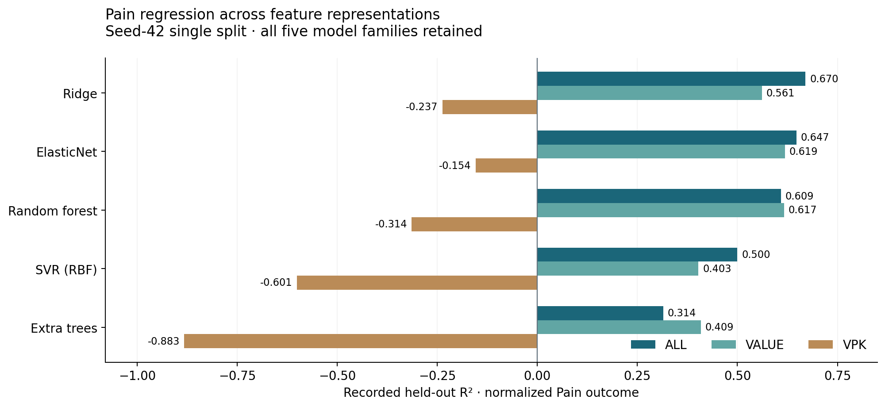
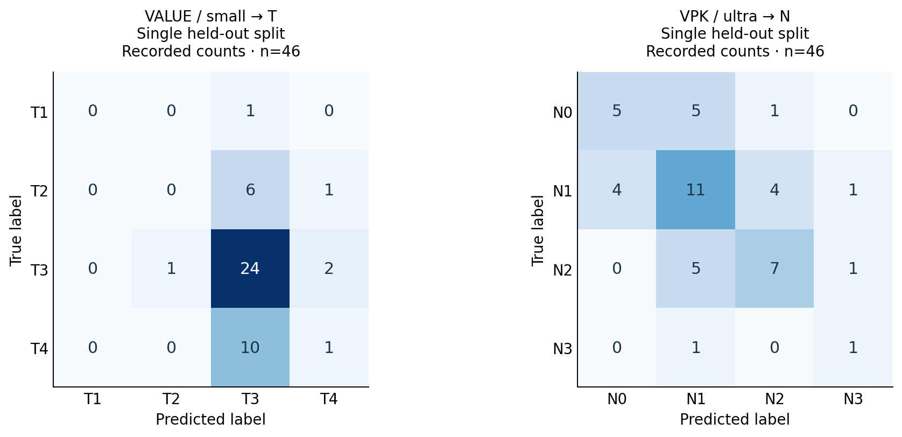

# Recorded results and diagnostics

This appendix presents the saved aggregates without rerunning the clinical cohort. Different targets, preprocessing histories and evaluation protocols stay separate. Missing dispersion values are shown as unavailable, not zero. The [experiment guide](experiments.md) explains the methods; the [workbook](../results/medtech-results.xlsx) provides filterable tables and a lossless numeric source ledger.

## Pain regression: complete held-out comparison

Pain was min-max scaled before splitting. MAE and RMSE use normalized units; MSE uses squared normalized units. The split is seed 42, 80/20, with 46 test records.

| Features | Model | MAE | RMSE | MSE | R² | EVS |
| --- | --- | --- | --- | --- | --- | --- |
| all | Ridge | 0.103829 | 0.129830 | 0.016856 | 0.670133 | 0.677151 |
| all | ElasticNet | 0.105581 | 0.134287 | 0.018033 | 0.647098 | 0.654326 |
| all | RandomForestRegressor | 0.112857 | 0.141427 | 0.020002 | 0.608570 | 0.639085 |
| all | SVR-RBF | 0.128846 | 0.159911 | 0.025572 | 0.499564 | 0.556064 |
| all | ExtraTreesRegressor | 0.147116 | 0.187170 | 0.035033 | 0.314416 | 0.387285 |
| value | ElasticNet | 0.114817 | 0.139555 | 0.019476 | 0.618865 | 0.619205 |
| value | RandomForestRegressor | 0.110300 | 0.139962 | 0.019589 | 0.616636 | 0.618900 |
| value | Ridge | 0.123388 | 0.149722 | 0.022417 | 0.561309 | 0.562417 |
| value | ExtraTreesRegressor | 0.126307 | 0.173851 | 0.030224 | 0.408517 | 0.409433 |
| value | SVR-RBF | 0.134523 | 0.174729 | 0.030530 | 0.402525 | 0.421032 |
| vpk | ElasticNet | 0.199599 | 0.242839 | 0.058971 | -0.154056 | 0.001263 |
| vpk | Ridge | 0.213778 | 0.251455 | 0.063230 | -0.237399 | -0.090294 |
| vpk | RandomForestRegressor | 0.206622 | 0.259109 | 0.067138 | -0.313878 | -0.180281 |
| vpk | SVR-RBF | 0.222313 | 0.286020 | 0.081808 | -0.600968 | -0.545222 |
| vpk | ExtraTreesRegressor | 0.245866 | 0.310175 | 0.096208 | -0.882794 | -0.810110 |

## Classification: complete held-out comparison

Notebook 04 uses separate stratified T and N splits. Both use 46 test records, but the two targets do not necessarily use the same held-out records. Balanced accuracy is average class recall; macro F1 gives each class equal weight.

| Features | Target | Setting | Model | Accuracy | Balanced accuracy | Macro F1 | Weighted F1 | Macro precision | Macro recall |
| --- | --- | --- | --- | --- | --- | --- | --- | --- | --- |
| all | N | ordinal | Ord-RandomForest | 0.500000 | 0.335714 | 0.320290 | 0.453056 | 0.332576 | 0.335714 |
| all | N | ordinal | Ord-ElasticNet-LogReg | 0.391304 | 0.329167 | 0.306345 | 0.386858 | 0.316667 | 0.329167 |
| all | N | ordinal | Ord-ExtraTrees | 0.456522 | 0.311905 | 0.298790 | 0.429150 | 0.292857 | 0.311905 |
| all | N | ordinal | Ord-SVM-RBF | 0.434783 | 0.255952 | 0.202632 | 0.328833 | 0.186813 | 0.255952 |
| all | N | standard | SVM-RBF | 0.413043 | 0.336310 | 0.322981 | 0.415947 | 0.324279 | 0.336310 |
| all | N | standard | ExtraTrees | 0.456522 | 0.311905 | 0.298750 | 0.423152 | 0.299145 | 0.311905 |
| all | N | standard | RandomForest | 0.434783 | 0.291071 | 0.277717 | 0.396314 | 0.280825 | 0.291071 |
| all | N | standard | ElasticNet-LogReg | 0.260870 | 0.208929 | 0.205833 | 0.269130 | 0.211264 | 0.208929 |
| all | T | ordinal | Ord-ExtraTrees | 0.543478 | 0.285354 | 0.269355 | 0.493268 | 0.261111 | 0.285354 |
| all | T | ordinal | Ord-ElasticNet-LogReg | 0.282609 | 0.280063 | 0.218410 | 0.277706 | 0.250000 | 0.280063 |
| all | T | ordinal | Ord-SVM-RBF | 0.586957 | 0.250000 | 0.184932 | 0.434187 | 0.146739 | 0.250000 |
| all | T | ordinal | Ord-RandomForest | 0.521739 | 0.235690 | 0.202892 | 0.432876 | 0.193750 | 0.235690 |
| all | T | standard | SVM-RBF | 0.478261 | 0.323954 | 0.318834 | 0.486317 | 0.320455 | 0.323954 |
| all | T | standard | ElasticNet-LogReg | 0.326087 | 0.271645 | 0.235560 | 0.339300 | 0.243006 | 0.271645 |
| all | T | standard | RandomForest | 0.565217 | 0.267677 | 0.245771 | 0.484274 | 0.275000 | 0.267677 |
| all | T | standard | ExtraTrees | 0.521739 | 0.249158 | 0.231731 | 0.457107 | 0.244737 | 0.249158 |
| value | N | ordinal | Ord-ExtraTrees | 0.391304 | 0.285119 | 0.279177 | 0.386069 | 0.282458 | 0.285119 |
| value | N | ordinal | Ord-RandomForest | 0.391304 | 0.276190 | 0.269080 | 0.374897 | 0.267857 | 0.276190 |
| value | N | ordinal | Ord-SVM-RBF | 0.478261 | 0.270833 | 0.197253 | 0.332250 | 0.244318 | 0.270833 |
| value | N | ordinal | Ord-ElasticNet-LogReg | 0.239130 | 0.210714 | 0.191714 | 0.239444 | 0.294143 | 0.210714 |
| value | N | standard | RandomForest | 0.456522 | 0.329762 | 0.317262 | 0.441304 | 0.321429 | 0.329762 |
| value | N | standard | ExtraTrees | 0.434783 | 0.326190 | 0.326923 | 0.441137 | 0.329323 | 0.326190 |
| value | N | standard | SVM-RBF | 0.391304 | 0.320238 | 0.304429 | 0.395244 | 0.313510 | 0.320238 |
| value | N | standard | ElasticNet-LogReg | 0.326087 | 0.249405 | 0.259894 | 0.347518 | 0.274621 | 0.249405 |
| value | T | ordinal | Ord-SVM-RBF | 0.586957 | 0.250000 | 0.184932 | 0.434187 | 0.146739 | 0.250000 |
| value | T | ordinal | Ord-ElasticNet-LogReg | 0.195652 | 0.242544 | 0.153636 | 0.160132 | 0.173395 | 0.242544 |
| value | T | ordinal | Ord-RandomForest | 0.434783 | 0.225108 | 0.218619 | 0.399896 | 0.224020 | 0.225108 |
| value | T | ordinal | Ord-ExtraTrees | 0.434783 | 0.225108 | 0.217253 | 0.399703 | 0.224020 | 0.225108 |
| value | T | standard | ExtraTrees | 0.434783 | 0.238576 | 0.238606 | 0.416251 | 0.251860 | 0.238576 |
| value | T | standard | SVM-RBF | 0.304348 | 0.235931 | 0.216558 | 0.316637 | 0.225000 | 0.235931 |
| value | T | standard | RandomForest | 0.434783 | 0.225108 | 0.218619 | 0.399896 | 0.224020 | 0.225108 |
| value | T | standard | ElasticNet-LogReg | 0.260870 | 0.217412 | 0.189312 | 0.275284 | 0.202451 | 0.217412 |
| vpk | N | ordinal | Ord-RandomForest | 0.347826 | 0.269643 | 0.264994 | 0.345849 | 0.261101 | 0.269643 |
| vpk | N | ordinal | Ord-ExtraTrees | 0.326087 | 0.248810 | 0.244994 | 0.324979 | 0.241871 | 0.248810 |
| vpk | N | ordinal | Ord-SVM-RBF | 0.391304 | 0.232143 | 0.185550 | 0.301564 | 0.163664 | 0.232143 |
| vpk | N | ordinal | Ord-ElasticNet-LogReg | 0.260870 | 0.213690 | 0.209091 | 0.274704 | 0.248413 | 0.213690 |
| vpk | N | standard | SVM-RBF | 0.369565 | 0.312500 | 0.290196 | 0.376726 | 0.334596 | 0.312500 |
| vpk | N | standard | RandomForest | 0.369565 | 0.290476 | 0.280332 | 0.364754 | 0.273183 | 0.290476 |
| vpk | N | standard | ElasticNet-LogReg | 0.326087 | 0.261905 | 0.243310 | 0.320166 | 0.241176 | 0.261905 |
| vpk | N | standard | ExtraTrees | 0.282609 | 0.225000 | 0.216700 | 0.281233 | 0.212607 | 0.225000 |
| vpk | T | ordinal | Ord-ElasticNet-LogReg | 0.391304 | 0.366282 | 0.297394 | 0.400092 | 0.342974 | 0.366282 |
| vpk | T | ordinal | Ord-RandomForest | 0.586957 | 0.343795 | 0.341602 | 0.556964 | 0.361032 | 0.343795 |
| vpk | T | ordinal | Ord-ExtraTrees | 0.478261 | 0.310486 | 0.304732 | 0.491420 | 0.308333 | 0.310486 |
| vpk | T | ordinal | Ord-SVM-RBF | 0.586957 | 0.250000 | 0.184932 | 0.434187 | 0.146739 | 0.250000 |
| vpk | T | standard | ElasticNet-LogReg | 0.521739 | 0.395382 | 0.367210 | 0.543305 | 0.370445 | 0.395382 |
| vpk | T | standard | SVM-RBF | 0.478261 | 0.390332 | 0.352738 | 0.490512 | 0.353554 | 0.390332 |
| vpk | T | standard | RandomForest | 0.565217 | 0.308081 | 0.288636 | 0.519565 | 0.272727 | 0.308081 |
| vpk | T | standard | ExtraTrees | 0.500000 | 0.293290 | 0.290260 | 0.492885 | 0.287338 | 0.293290 |

## Repeated classification CV

Five folds × three repeats. VPK→T and ALL→N use training-fold augmentation where configured. These are saved means; fold-level score dispersion is unavailable. The matrix diagnostics saved by this notebook are from the last fold only.

| Features | Target | Setting | Model | Mean accuracy | Mean balanced accuracy | Mean macro F1 | Mean weighted F1 | Mean macro precision | Mean macro recall |
| --- | --- | --- | --- | --- | --- | --- | --- | --- | --- |
| all | N | latent_round | SVR | 0.449984 | 0.303324 | 0.292351 | 0.416193 | 0.309438 | 0.303324 |
| all | N | latent_round | ElasticNet | 0.429179 | 0.275108 | 0.253152 | 0.374924 | 0.258796 | 0.275108 |
| all | N | latent_round | Ridge | 0.412915 | 0.264693 | 0.248286 | 0.370173 | 0.260172 | 0.264693 |
| all | N | latent_round | RFReg | 0.457198 | 0.262406 | 0.207598 | 0.340347 | 0.221697 | 0.262406 |
| all | N | latent_round | ETReg | 0.362931 | 0.254911 | 0.247680 | 0.348844 | 0.247197 | 0.254911 |
| all | N | latent_threshold | SVR | 0.445539 | 0.311979 | 0.306685 | 0.427178 | 0.316878 | 0.311979 |
| all | N | latent_threshold | Ridge | 0.302319 | 0.288897 | 0.260968 | 0.310387 | 0.274595 | 0.288897 |
| all | N | latent_threshold | RFReg | 0.434944 | 0.279525 | 0.258894 | 0.383024 | 0.274162 | 0.279525 |
| all | N | latent_threshold | ElasticNet | 0.288953 | 0.262205 | 0.240227 | 0.296532 | 0.251573 | 0.262205 |
| all | N | latent_threshold | ETReg | 0.362931 | 0.254911 | 0.247680 | 0.348844 | 0.247197 | 0.254911 |
| all | N | ordinal | Ord-ElasticNet-LogReg | 0.324348 | 0.290287 | 0.269748 | 0.334865 | 0.290339 | 0.290287 |
| all | N | ordinal | Ord-RandomForest | 0.423349 | 0.282647 | 0.268245 | 0.389270 | 0.269281 | 0.282647 |
| all | N | ordinal | Ord-ExtraTrees | 0.407021 | 0.279838 | 0.273210 | 0.387952 | 0.281609 | 0.279838 |
| all | N | ordinal | Ord-SVM-RBF | 0.476425 | 0.274026 | 0.210841 | 0.350066 | 0.204738 | 0.274026 |
| all | N | standard | ExtraTrees | 0.424799 | 0.287369 | 0.278836 | 0.398831 | 0.286127 | 0.287369 |
| all | N | standard | RandomForest | 0.430692 | 0.287345 | 0.274791 | 0.394547 | 0.283246 | 0.287345 |
| all | N | standard | SVM-RBF | 0.361288 | 0.271836 | 0.262335 | 0.360725 | 0.267934 | 0.271836 |
| all | N | standard | DummyStratified | 0.352657 | 0.267199 | 0.262147 | 0.342376 | 0.263803 | 0.267199 |
| all | N | standard | ElasticNet-LogReg | 0.306892 | 0.261130 | 0.248168 | 0.317726 | 0.257753 | 0.261130 |
| all | N | standard | DummyMostFreq | 0.469082 | 0.250000 | 0.159634 | 0.299630 | 0.117271 | 0.250000 |
| vpk | T | latent_round | ETReg | 0.459936 | 0.264158 | 0.259963 | 0.445791 | 0.265929 | 0.264158 |
| vpk | T | latent_round | SVR | 0.496908 | 0.253753 | 0.241969 | 0.451362 | 0.247132 | 0.253753 |
| vpk | T | latent_round | ElasticNet | 0.542705 | 0.248633 | 0.216635 | 0.449608 | 0.232141 | 0.248633 |
| vpk | T | latent_round | Ridge | 0.527987 | 0.245845 | 0.216844 | 0.446531 | 0.211148 | 0.245845 |
| vpk | T | latent_round | RFReg | 0.522126 | 0.240064 | 0.215420 | 0.443161 | 0.237514 | 0.240064 |
| vpk | T | latent_threshold | ElasticNet | 0.292013 | 0.297134 | 0.231627 | 0.291094 | 0.290101 | 0.297134 |
| vpk | T | latent_threshold | Ridge | 0.263865 | 0.262462 | 0.208794 | 0.259672 | 0.268144 | 0.262462 |
| vpk | T | latent_threshold | ETReg | 0.436361 | 0.257183 | 0.252830 | 0.430820 | 0.254196 | 0.257183 |
| vpk | T | latent_threshold | SVR | 0.426377 | 0.249486 | 0.245405 | 0.425001 | 0.250275 | 0.249486 |
| vpk | T | latent_threshold | RFReg | 0.426119 | 0.224973 | 0.216982 | 0.407522 | 0.217966 | 0.224973 |
| vpk | T | ordinal | Ord-ElasticNet-LogReg | 0.306892 | 0.263961 | 0.222409 | 0.312966 | 0.268561 | 0.263961 |
| vpk | T | ordinal | Ord-ExtraTrees | 0.469082 | 0.263400 | 0.259808 | 0.456353 | 0.261562 | 0.263400 |
| vpk | T | ordinal | Ord-RandomForest | 0.494138 | 0.261841 | 0.255809 | 0.466064 | 0.261630 | 0.261841 |
| vpk | T | ordinal | Ord-SVM-RBF | 0.575169 | 0.244421 | 0.182688 | 0.430037 | 0.145936 | 0.244421 |
| vpk | T | standard | DummyStratified | 0.405443 | 0.307625 | 0.278305 | 0.416031 | 0.283137 | 0.307625 |
| vpk | T | standard | ElasticNet-LogReg | 0.368760 | 0.262325 | 0.251243 | 0.394849 | 0.275898 | 0.262325 |
| vpk | T | standard | RandomForest | 0.485250 | 0.256247 | 0.249956 | 0.458768 | 0.253500 | 0.256247 |
| vpk | T | standard | ExtraTrees | 0.461739 | 0.255864 | 0.253995 | 0.448916 | 0.258834 | 0.255864 |
| vpk | T | standard | SVM-RBF | 0.352560 | 0.254016 | 0.239781 | 0.373517 | 0.257473 | 0.254016 |
| vpk | T | standard | DummyMostFreq | 0.588502 | 0.250000 | 0.185226 | 0.436102 | 0.147126 | 0.250000 |

## Neural multitask experiments

The separate T/N notebook uses a single T-stratified hold-out split with 46 test records and training-only duplication. Pain statistics describe the shared regression head. The workbook Table 6 contains a different recorded run of this family; its values are preserved separately and await exact source matching.

| Features | Architecture | T accuracy | T balanced acc | T macro F1 | N accuracy | N balanced acc | N macro F1 | Pain MAE | Pain RMSE | Pain R² |
| --- | --- | --- | --- | --- | --- | --- | --- | --- | --- | --- |
| value | small | 0.543500 | 0.244900 | 0.209800 | 0.391300 | 0.282900 | 0.251500 | 0.120200 | 0.156500 | 0.471800 |
| value | big | 0.434800 | 0.238600 | 0.245800 | 0.369600 | 0.270400 | 0.250600 | 0.128000 | 0.165600 | 0.408000 |
| value | ultra | 0.478300 | 0.270600 | 0.275300 | 0.326100 | 0.248900 | 0.199000 | 0.110100 | 0.145000 | 0.546600 |
| vpk | small | 0.608700 | 0.353500 | 0.320800 | 0.391300 | 0.275900 | 0.277700 | 0.171400 | 0.227200 | -0.113400 |
| vpk | big | 0.521700 | 0.276100 | 0.264700 | 0.434800 | 0.341500 | 0.353800 | 0.159900 | 0.215700 | -0.003700 |
| vpk | ultra | 0.565200 | 0.334500 | 0.330700 | 0.521700 | 0.510800 | 0.496000 | 0.173100 | 0.227500 | -0.117100 |
| all | small | 0.543500 | 0.285400 | 0.264600 | 0.347800 | 0.230700 | 0.195600 | 0.138600 | 0.172000 | 0.361400 |
| all | big | 0.543500 | 0.312300 | 0.297100 | 0.413000 | 0.308800 | 0.310900 | 0.116000 | 0.143200 | 0.557400 |
| all | ultra | 0.587000 | 0.330300 | 0.334000 | 0.326100 | 0.241900 | 0.235600 | 0.130500 | 0.162700 | 0.428700 |

The left matrix shows why majority-class accuracy alone can be misleading: VALUE/small predicts predominantly T3. The right matrix records wider N-class coverage for VPK/ultra. These are different configurations from one held-out experiment, not evidence of a stable advantage under repeated CV.

### Joint-TNM architecture diagnostics

These runs replicated rare labels before splitting and use 49 test rows. They document developmental work; duplicated training/test copies may overlap. Full confidence, entropy, explained-variance and residual-variance values remain in JSON and the workbook's Neural diagnostics sheet.

| Features | Architecture | Accuracy | Balanced accuracy | Macro F1 | Pain MAE | Pain RMSE | Pain MSE | Pain R² |
| --- | --- | --- | --- | --- | --- | --- | --- | --- |
| value | big | 0.387800 | 0.206800 | 0.179900 | 0.139700 | 0.172300 | 0.029700 | 0.507100 |
| vpk | big | 0.387800 | 0.393800 | 0.335700 | 0.171300 | 0.219000 | 0.047900 | 0.203600 |
| all | big | 0.306100 | 0.381500 | 0.321000 | 0.138000 | 0.171600 | 0.029400 | 0.510800 |
| value | small | 0.367300 | 0.067900 | 0.046300 | 0.123400 | 0.151200 | 0.022900 | 0.620000 |
| vpk | small | 0.326500 | 0.124100 | 0.108800 | 0.179300 | 0.228100 | 0.052000 | 0.135400 |
| all | small | 0.265300 | 0.270400 | 0.233800 | 0.119600 | 0.141200 | 0.019900 | 0.668900 |

### Early recorded joint-TNM runs

The confirmed MSE values were originally mislabeled RMSE. Later VPK/ALL outputs use a different, unavailable kernel definition and retain their reported RMSE. Values are unchanged. The forest scalar 0.8893805309734514 is an **in-sample training accuracy**, not held-out performance.

| Run ID | Features | Accuracy | Balanced accuracy | Macro F1 | Pain MAE | Reported pain error | Definition |
| --- | --- | --- | --- | --- | --- | --- | --- |
| joint-early-25-value | value | 0.387800 | 0.129600 | 0.100800 | 0.148000 | 0.037900 | MSE confirmed from saved function |
| joint-early-25-vpk | vpk | 0.367300 | 0.055600 | 0.030800 | 0.209700 | 0.080300 | MSE confirmed from saved function |
| joint-early-25-all | all | 0.367300 | 0.055600 | 0.029900 | 0.191700 | 0.061700 | MSE confirmed from saved function |
| joint-early-26-value | value | 0.346900 | 0.104900 | 0.057900 | 0.138300 | 0.027700 | MSE confirmed from saved function |
| joint-early-27-vpk | vpk | 0.260900 | 0.089100 | 0.055600 | 0.523600 | 0.571000 | RMSE reported; executed function version unavailable |
| joint-early-28-all | all | 0.087000 | 0.129900 | 0.050100 | 0.395700 | 0.465700 | RMSE reported; executed function version unavailable |

## PCA results

The full 150-row saved summary, including T/VPK configurations and the 15-component setting missing from the original spreadsheet layout, is in the workbook and JSON. Latent rows pool round/threshold decoding means. Their reported SD is between the two means, not fold dispersion. Standard/ordinal SDs are unavailable. Historical 200-row comparison deltas remain in JSON; their broad-family latent join is not a method-matched improvement estimate. Future code distinguishes decoding modes and matches comparisons accordingly.

## Confusion-matrix archive

All **112 matrices** are preserved in [confusion-matrices.json](../results/confusion-matrices.json), the workbook's Confusion counts table and notebook outputs: 6 joint-TNM, 18 separate T/N, 48 classical held-out and 40 final-CV-fold matrices. Rows are true labels and columns are predictions. The archive stores every count, sample total and accuracy derived from the diagonal.

T/N labels are recoverable from saved encoder mappings. Joint-TNM matrices use scikit-learn's implicit union of observed/predicted encoded labels; the exact union was not saved. Matrix positions are retained without assigning unverified TNM labels. Do not reinterpret those matrices as a fixed 21×21 labeled grid.

## Missing sources and outliers

The original workbook's 12 RF/SVM Stage/Pain classifier rows are real results, retained with all metrics in the Phase 2 sheet and JSON. Their source notebooks and target definitions are not yet located. Nine alternate multitask runs and two earlier joint-TNM function outputs also need source matching.

**Top-ten outlier rankings are not present in the supplied material.** Aggregate MAE/MSE, residual variance and confusion counts cannot reconstruct per-record error rankings. Recover the missing notebook or predictions, then produce an anonymized ranked summary. See the durable [Phase 2 handoff](phase-2.md).
